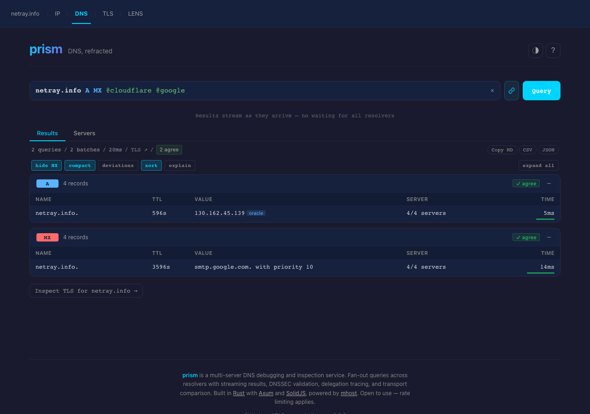
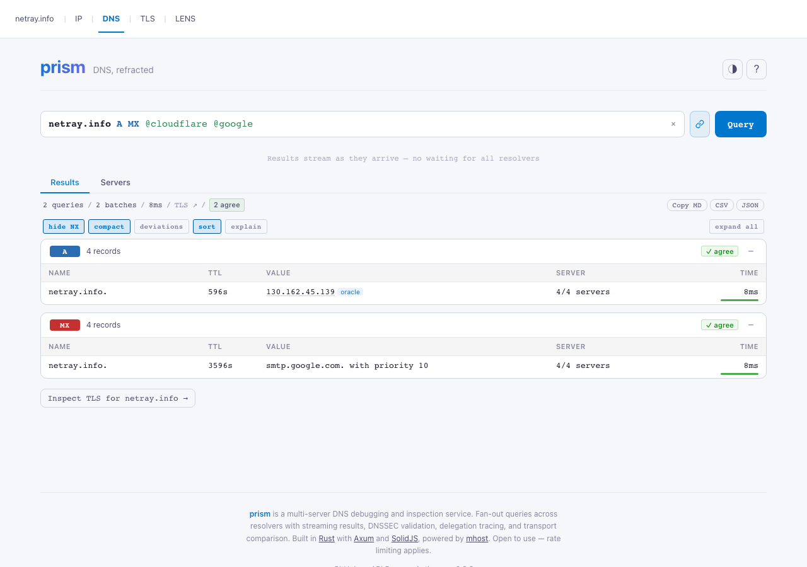
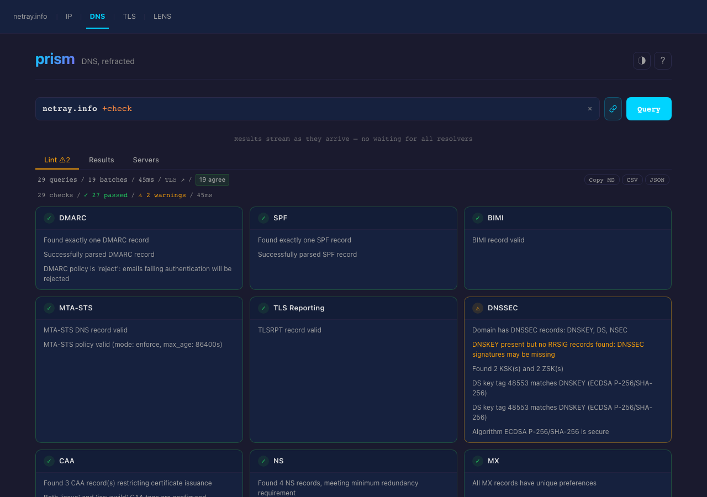
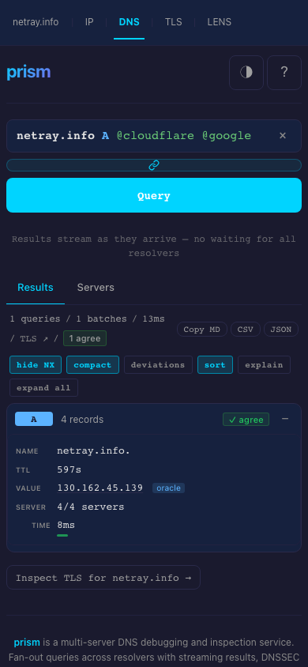

<div align="center">

# **prism** — DNS, refracted

**Multi-resolver fan-out. Six diagnostic modes. Streaming results.**

[](https://dns.netray.info)
[](https://dns.netray.info/docs)
[](CHANGELOG.md)
[](LICENSE)

<br>

*Asks the questions `dig` can't ask — like "do all my resolvers agree?" and "is my ISP lying to me?"*

<br>



<br>

</div>

---

## What it does

Type a domain — or a full query with record types, resolvers, and flags. Results stream in per-resolver as they arrive, color-coded by record type, with live TTL countdowns. When resolvers disagree, the difference is highlighted immediately.

Six modes cover everything from a quick A record lookup to a full DNSSEC chain-of-trust audit:

| Mode | What it answers |
|---|---|
| **Query** | Do all my resolvers return the same answer? Who's slow? Who drops records? |
| **Check** | Is this domain's DNS configured correctly? SPF, DMARC, MTA-STS, DNSSEC, CAA — all at once |
| **Trace** | Which nameservers own this domain, and how do I reach them from the root? |
| **Compare** | Does DNS over UDP, TCP, TLS, and HTTPS give the same result? (Detects middlebox interference) |
| **Auth** | What do the authoritative nameservers say vs. what the recursive resolver serves? (Detects stale caches) |
| **DNSSEC** | Is the DNSSEC chain of trust intact end-to-end? |

---

## Screenshots

*Querying [netray.info](https://dns.netray.info/?q=netray.info+A+MX+%40cloudflare+%40google) across Cloudflare and Google resolvers.*

<table>
<tr>
<td width="50%">

**Dark theme — multi-resolver query**


</td>
<td width="50%">

**Light theme — multi-resolver query**



</td>
</tr>
<tr>
<td width="50%">

**Check mode — full domain audit**



</td>
<td width="50%">

**Mobile**



</td>
</tr>
</table>

---

## Try it

**Browser** — [dns.netray.info](https://dns.netray.info)

```sh
# Multi-resolver fan-out
curl 'https://dns.netray.info/api/query?q=netray.info+A+MX+%40cloudflare+%40google'

# Full domain health check
curl 'https://dns.netray.info/api/query?q=netray.info+%2Bcheck'

# Delegation trace from root
curl 'https://dns.netray.info/api/query?q=netray.info+%2Btrace'

# Transport comparison (UDP vs TCP vs DoT vs DoH)
curl 'https://dns.netray.info/api/query?q=netray.info+A+%2Bcompare'
```

**Shareable link:** `https://dns.netray.info/?q=netray.info+A+MX+@cloudflare+@google`

---

## The query language

Inspired by `dig`, extended for multi-resolver debugging:

```
domain [TYPE...] [@server...] [+flag...]
```

### Record types

Any standard DNS type: `A`, `AAAA`, `MX`, `TXT`, `NS`, `CNAME`, `CAA`, `TLSA`, `SOA`, `PTR`, `SRV`, `SVCB`, `HTTPS`, `DNSKEY`, `DS`, …

### Resolver aliases

| Alias | Resolvers |
|---|---|
| `@cloudflare` | 1.1.1.1 + 1.0.0.1 |
| `@google` | 8.8.8.8 + 8.8.4.4 |
| `@quad9` | 9.9.9.9 + 149.112.112.112 |
| `@public` | Cloudflare + Google + Quad9 |
| `@all` | All public resolvers (capped at 4) |

### Flags

| Flag | What it does |
|---|---|
| `+tls` | Query over DNS-over-TLS |
| `+https` | Query over DNS-over-HTTPS |
| `+tcp` | Force TCP (no UDP) |
| `+dnssec` | Request DNSSEC records (DO bit) |
| `+norecurse` | Non-recursive query (RD=0) |
| `+short` | Suppress TTL display |
| `+check` | Switch to Check mode (full domain audit) |
| `+trace` | Switch to Trace mode (delegation walk from root) |
| `+compare` | Switch to Compare mode (all four transports) |
| `+auth` | Switch to Auth mode (authoritative vs recursive) |

### Examples

```
# Who serves netray.info's MX records, and do resolvers agree?
netray.info MX @cloudflare @google @quad9

# Is the DNSSEC chain intact?
netray.info DNSKEY DS @cloudflare +dnssec

# Full domain audit
netray.info +check

# Trace the delegation chain from root
netray.info +trace

# Does DoH give a different answer than UDP? (ISP DNS hijacking test)
netray.info A @cloudflare +compare

# What does the authoritative server say vs. the recursive resolver?
netray.info A @google +auth

# Force DoT to bypass port-53 blocking
netray.info A @cloudflare +tls
```

---

## Six modes in depth

### Query

Fan-out to up to 4 resolvers simultaneously. Results stream per record type — no waiting for the slowest resolver. Divergences (different data or TTLs) are highlighted in red and amber respectively.

**Cost**: `record_types × resolvers` rate-limit tokens.

### Check

Full domain audit: 15 record types plus advanced lint checks. Detects:
- Missing or misconfigured SPF, DMARC, DKIM, MTA-STS, TLSRPT, CAA
- NS lame delegation (AA bit validation per nameserver)
- Parent vs. child NS set divergence
- DNSSEC rollover issues (multiple KSKs, orphaned DS, missing DS for new KSK)
- Deprecated DNSKEY algorithms (RSA/MD5, RSA/SHA-1)

**Cost**: `16 × server_count` tokens.

### Trace

Iterative delegation walk from the root zone to the authoritative nameserver, hop by hop. Shows latency at each step — useful for spotting slow or broken delegations.

**Cost**: 16 tokens flat.

### Compare

Queries the same domain simultaneously over UDP, TCP, DoT, and DoH. Detects middlebox DNS interference, NXDOMAIN injection, and resolver policy differences.

**Cost**: `record_types × resolvers × 4` tokens.

### Auth

Compares what the authoritative nameservers say (RD=0) against what the recursive resolver serves. Detects stale caches and NXDOMAIN hijacking.

**Cost**: `record_types × servers + 16` tokens.

### DNSSEC

Fetches DNSKEY and DS records and displays the chain of trust. Surfaces algorithm types and key tags.

---

## API

### Query endpoint

```
GET  /api/query?q=<query>
POST /api/query  {"domain":"...","record_types":[...],"servers":[...],"transport":"tls"}
```

By default returns an SSE stream. Set `?stream=false` or `Accept: application/json` to collect the full stream and return a single JSON object: `{"events":[...],"truncated":false}`.

```sh
# SSE stream
curl -N 'https://dns.netray.info/api/query?q=netray.info+A+%40cloudflare+%40google'

# Single JSON response
curl -s 'https://dns.netray.info/api/query?q=netray.info+A&stream=false'
```

### Other endpoints

| Endpoint | Description |
|---|---|
| `GET /api/servers` | Available resolver list |
| `GET /api/record-types` | Supported record types |
| `GET /api/config` | Active server configuration |
| `GET /health` | Liveness probe |
| `GET /ready` | Readiness probe |
| `GET /api-docs/openapi.json` | OpenAPI 3.1 spec |
| `GET /docs` | Interactive API docs (Scalar UI) |

---

## Deployment

### From source

```sh
git clone https://github.com/lukaspustina/mhost-prism
cd mhost-prism
make
./target/release/prism prism.example.toml
# http://localhost:8080
```

### Configuration

Copy `prism.example.toml` and adjust:

```toml
[server]
bind = "0.0.0.0:8080"
metrics_bind = "127.0.0.1:9090"
# trusted_proxies = ["10.0.0.0/8"]

[rate_limit]
per_ip_per_minute = 60
per_ip_burst = 10
global_per_minute = 600
global_burst = 50

[cache]
enabled = true
ttl_seconds = 300

[ip_enrichment]
# url = "https://ip.netray.info"   # enables IP badges in results
```

Override any value with `PRISM_` env vars (`__` for nested sections): `PRISM_SERVER__BIND=0.0.0.0:8080`.

### Build targets

```sh
make          # frontend + release binary
make dev      # cargo run (port 8080)
make test     # all tests
make ci       # full gate: fmt, clippy, test, frontend, audit
```

---

## Security model

Four layers of defense — this is a public DNS proxy, not just a query tool:

1. **Query restrictions** — blocked types (ANY, AXFR, IXFR), no RFC 1918/loopback/CGNAT targets, max 10 record types, max 4 resolvers
2. **Rate limiting** — 3-tier GCRA (per-IP, per-target, global) with query cost model
3. **IP extraction** — trusted-proxy CIDR validation for real client IP
4. **Security headers** — CSP, HSTS, X-Frame-Options, X-Content-Type-Options on all responses

---

## Tech stack

**Backend** — Rust · Axum 0.8 · mhost (DNS library) · tokio · tower · utoipa (OpenAPI 3.1) · rust-embed

**Frontend** — SolidJS 1.9 · CodeMirror 6 (query input) · Vite · TypeScript (strict)

**Part of** — [netray.info](https://netray.info) suite: [IP](https://ip.netray.info) · [TLS](https://tls.netray.info) · [HTTP](https://http.netray.info) · [Email](https://email.netray.info) · [Lens](https://lens.netray.info)

---

## License

MIT / Apache-2.0 — see [LICENSE](LICENSE).
